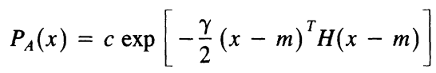
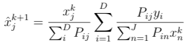
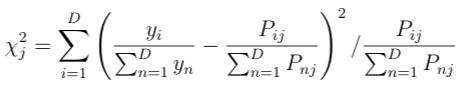
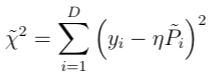

# Reconstruction
Majorana also provides methods for reconstructing quantities from SiPM data. Currently, there are two algorithms provided for reconstruction:
1. Maximum A Posteriori (MAP) Method 
2. Chi-Squared Method

Fundementally, the reconstruction algorithms require the probability that a photon leaving any position will be detected by any SiPM. Therefore, you must generate an optical lookup-table from the `simulateOutput.root` ntuple that was produced using a particular pixelization scheme in pixel mode. 

There is a sample script in `scripts/makeOpRefTable/` that will produce the lookup-table. Simply make a class using the `scripts/makeClass.C` script that points to the ntuple, and copy over the code in the sample `makeOpRefTable.C`. You will need to edit the parameters in the script to fit your application (WARNING: Some things are hardcoded). The script essentially takes the number of emitted and detected photons for each event and converts to a probability for each pixel/SiPM combination (e.g. See the optimization section below for further discussion on generating lookup-tables). Running this script will generate a text file named `NPIXELSp_NSIPMSs_opReferenceTable.txt`. The reconstructing algorithms will use the probabilities in this file.

## Maximum A Posteriori Method
This MAP method is based on an [algorithm](https://ieeexplore.ieee.org/document/4307826) used in Emission Computed Tomography. Among many others, this algorithm was chosen because of its simplicity and our assumed point-like light source.

The posterior can be written as *P**B*(*x*|*y*) = *P**L*(*y*|*x*)*P**A*(*x*)/*P*(*y*), where *P**L*(*y*|*x*) is the likelihood function and *P**A*(*x*) is the prior. The likelihood function is constructed assuming independent Possionian distributions modeling the photon counts for each SiPM. In principle, the prior distribution can take any form, but we chose a Gaussian form given our point-like source

 A recursive formula can be derived using an expectation-maximization procedure

where *x**j**k* is the *k-th* estimate of the number of photons emitted from the *j-th* pixel, *P**ij* is the probability of a photon leaving the *j-th* pixel being detected by the *i-th* SiPM, and *y**i* is the number of photons seen by the *i-th* SiPM. The *P**ij* is what we get from simulation.

The variables that are tunable are the parameters characterizing the prior distribution and the number of iterations to be performed (convergence checker could be implemented). This algorithm naturally reconstructs the energy and spatial distribution of the source.

## Chi-Squared Method
The chi-squared method is a simplier, faster algorithm. A chi-squared metric is constructed and minimized using the information from the lookup-table

The minimization of this quantity gives an estimate of the mean position (pixel) of the light source. So unlike the MAP method, the chi-squared method returns a mean position instead of a spatial distribution. 

Assuming that all of the photons were emitted from the reconstructed pixel site, the number of incident photons (energy), *η*, is reconstructed by minimizing the quantity

with respect to *η*, where the tilde represents the probabilities associated with the reconstructed pixel site.

## Optimization and Generating Other Lookup-Tables
By using a brute-force method (firing photons from every pixel), when scaling to larger disks or more SiPMs, the number of pixels becomes large resulting in significantly longer simulations. Therefore, there is a need for something smarter than the brute-force way.

There are two procedures practiced in Majorana that can have a significant impact on simulation time.

#### 1) Table Generation
Given the geometry, we actually have a multifold redundancy in the brute-force simulation. More explicity, since our SiPMs are equally spaced, we have a `1/numberOfSipms`-fold redundancy. In otherwords, the lookup-table is completely and uniquely determined by simulating one "pie piece" of the disk (e.g. the space between 2 adjacent SiPMs). Once this space is simulated, it is but a simple rotation (perhaps with some interpolation) to convert to the remaining spaces. As an example, for a 64-SiPM array, this symmetrical procedure could cut simulation time by 98%!

To avoid interpolation, the "pie piece" chosen is 1/4th of the disk. Therefore, with a symmetrical pixelization scheme, a *n * 90* degree rotation is an isomorphic transformation to the pixels located in the other respective pie pieces, reducing simulation time by 75% compared to the brute-force method. The script `scripts/makeOpRefTable_symmetry.py` is an example of this procedure.

#### 2) Conversion to Different Pixel Spacings
We've only mitigated one issue: simulation for a single pixelization spacing. What if we wanted to increase/decrease the pixel spacings? Do we have to rerun the entire simulation? Nope. 

Also provided are scripts, located in `scripts/makeSplines/`, that allow one to quickly, *O(1 minute)*, generate lookup tables for different pixelizations and number of SiPMs using the lookup-table for one pixelization scheme. The procedure taken in the scripts provided in Majorana can be split into two steps (Note: Because this method was created long ago, some of the code may need to be updated based on the path taken to this point):
1. Calculating average response
    
    Create a 2D light detection probability profile by averaging the response from several sipms (if brute-force method was used). 

2. Interpolation onto other schemes

    Using this profile (or lookup-table from symmetrical method), interpolate the 2D profile onto a new pixelization scheme.

This procedure was used to generate lookup-tables for 1-10mm spacings from a 5mm lookup-table. See the `README.md` files located therein for further details.